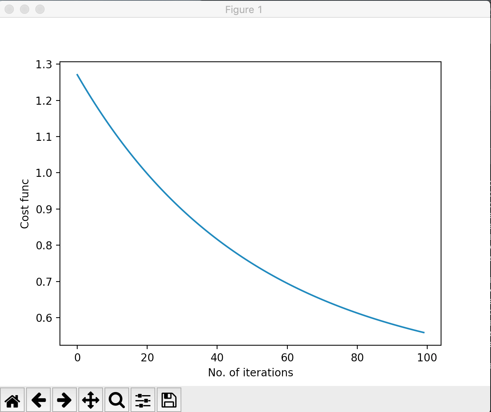
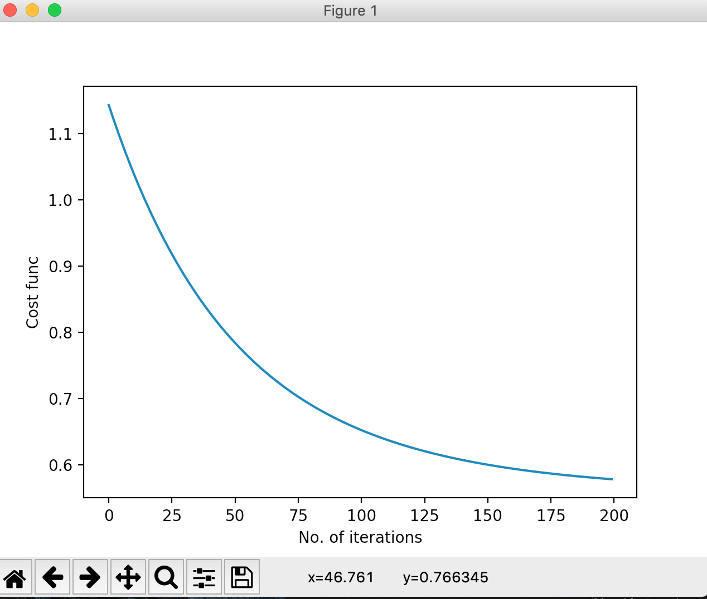

# ML-algorithms
An introduction to Machine Learning with an assignment implementing different ML algorithms.

[Linear Regression](https://github.com/anand-parth/ML-algorithms/blob/master/Q1.py)   
  

[Linear Regression with Stochastic Gradient Descent](https://github.com/anand-parth/ML-algorithms/blob/master/Q2.py)   
  

[Ridge Regression with Batch Gradient Descent](https://github.com/anand-parth/ML-algorithms/blob/master/Q3_bgd.py)   \
  

[Ridge Regression with Stochastic Gradient Descent](https://github.com/anand-parth/ML-algorithms/blob/master/Q3_sgd.py)   
  

[Vectorized Linear Regression](https://github.com/anand-parth/ML-algorithms/blob/master/Q4.py)   
  

[Least Angle Regression with Stochastic Gradient Descent](https://github.com/anand-parth/ML-algorithms/blob/master/Q5_bgd.py)   
  

[Least Angle Regression with Batch Gradient Descent](https://github.com/anand-parth/ML-algorithms/blob/master/Q5_sgd.py)   
  

[K-Means Clustering](https://github.com/anand-parth/ML-algorithms/blob/master/Q6.py)   
    
  

[Logistic Regression](https://github.com/anand-parth/ML-algorithms/blob/master/Q7.py)   
  

[Multiclasss Logistic Regression with One VS All](https://github.com/anand-parth/ML-algorithms/blob/master/Q8_one_vs_all.py)   
  
[Multiclasss Logistic Regression with One VS One](https://github.com/anand-parth/ML-algorithms/blob/master/Q8_one_vs_one.py)   
  
                      
[K-Fold Cross Validation](https://github.com/anand-parth/ML-algorithms/blob/master/Q9.py)   
  
                      
[Likelihood Ratio Test](https://github.com/anand-parth/ML-algorithms/blob/master/Q10.py)   
  
                      
[Maximum a posteriori(MAP)](https://github.com/anand-parth/ML-algorithms/blob/master/Q11.py)   
                        
[Maximum Likelihood(ML)](https://github.com/anand-parth/ML-algorithms/blob/master/Q12.py)   
  
